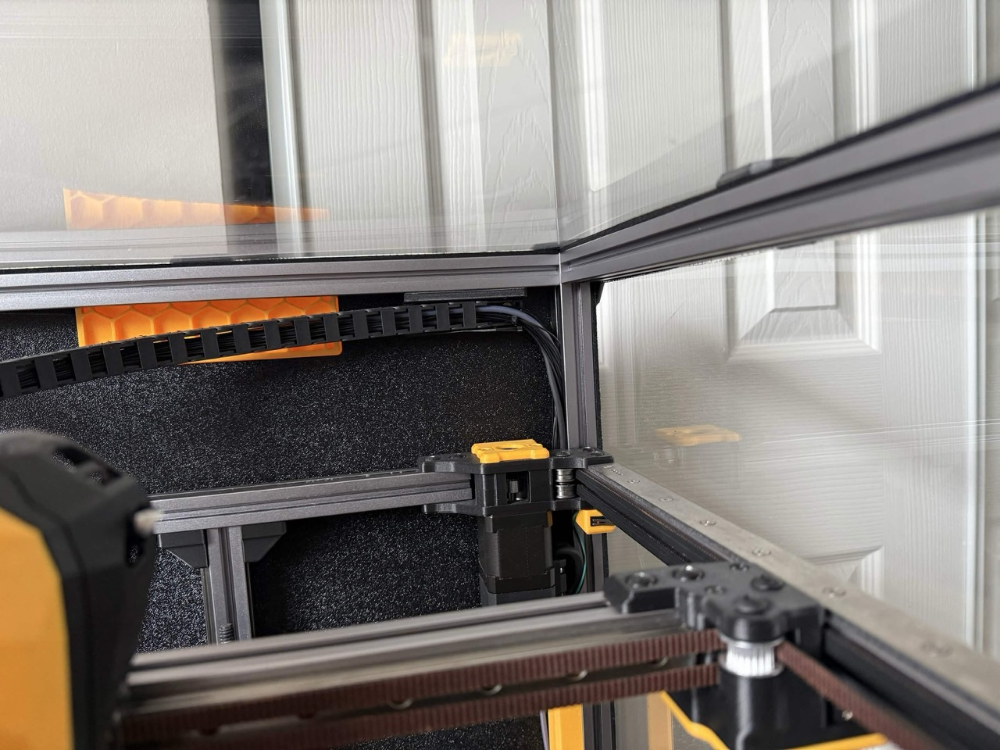

# Horizontal Chain Umbilical

## Components

**Corner PTFE Plate:** Alternative filament inlet path for the rear right corner (when viewed from the front). Requires a cutout in the back panel at that corner.

**Umbilical Mount (Bottom):** Attaches to the rear top horizontal extrusion from below. Available in 2- and 3-hole variants to suit different chain mount patterns.

**Umbilical Mount (Front):** Attaches to the rear top horizontal extrusion from the front. Available in 2- and 3-hole variants to suit different chain mount patterns.

## Images

